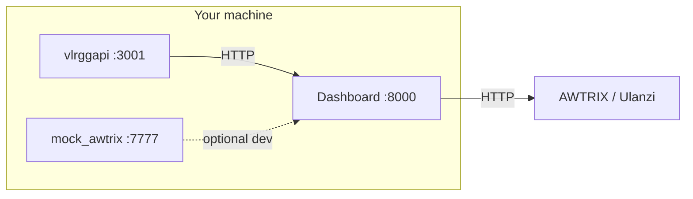

# Ulanzi VCT Dashboard

A **FastAPI** web dashboard and scheduler for driving **AWTRIX 3**-compatible pixel clocks (for example the **Ulanzi TC001**). It aggregates Valorant esports data (via a self-hosted **vlr.gg** API), weather, Reddit headlines, Twitch live channels, countdowns, and more, then pushes formatted text and colors to the matrix over HTTP.

This repository contains the **dashboard** only. Match and news data come from a separate project ([vlrggapi](#acknowledgements)) that you run locally or on another host.

---

## What’s included

- **Web UI** at `http://localhost:8000` for configuration and monitoring.
- **Modules** (toggle and order in `config.json`): recent results and upcoming matches, live match ticker, Twitch live alerts, countdowns, weather (Open-Meteo), Reddit posts, VLR news, word of the day, pinned text, timers.
- **AWTRIX HTTP API client** to send apps to a physical device, or a **mock AWTRIX server** for development without hardware.

---

## Architecture

Three processes are normally running:

| Role | Port | Purpose |
|------|------|---------|
| **vlrggapi** | `3001` | Unofficial REST API for [vlr.gg](https://www.vlr.gg/) (matches, news, etc.). **Separate repo** — not vendored here. |
| **Mock AWTRIX** (optional) | `7777` | Simulates the clock’s HTTP API when you don’t have the device on the network. |
| **This dashboard** | `8000` | FastAPI app: UI, scheduling, calls into vlrggapi and AWTRIX. |

With a **real Ulanzi / AWTRIX** device, point `awtrix_ip` in config at the device (e.g. `192.168.x.x:80`) and you can skip the mock server if you don’t need it for local testing.



---

## Prerequisites

- **Python** 3.10+ (3.11+ recommended; [vlrggapi](https://github.com/axsddlr/vlrggapi) documents Python 3.11).
- **Git** (to clone this repo and vlrggapi).
- Network access for **Open-Meteo**, **Reddit**, **Twitch** (if used), and your **AWTRIX** device or mock.

---

## Setup

### 1. Clone this repository

```bash
git clone https://github.com/darkcnight/Ulanzi-VCT-Dashboard.git
cd Ulanzi-VCT-Dashboard
```

### 2. Python environment

```bash
python -m venv venv
source venv/bin/activate   # Windows: venv\Scripts\activate
pip install -r requirements.txt
```

### 3. Configuration

```bash
cp config.example.json config.json
```

Edit `config.json`:

- **`awtrix_ip`** — IP and port of your AWTRIX device (e.g. `192.168.1.50:80`), or the mock server (`127.0.0.1:7777`) during development.
- **`weather`** — `location_name`, `latitude`, `longitude` for Open-Meteo.
- **`valorant`**, **`reddit`**, **`twitch`**, **`module_order`**, **`modules`**, **`app_colors`** — tune to taste.

Optional **Twitch** integration: copy `.env.example` to `.env` and set `TWITCH_CLIENT_ID` and `TWITCH_CLIENT_SECRET` from the [Twitch Developer Console](https://dev.twitch.tv/console/apps).

### 4. vlrggapi (required for Valorant modules)

Clone and run [axsddlr/vlrggapi](https://github.com/axsddlr/vlrggapi) in a separate directory. By default the API listens on **`http://127.0.0.1:3001`**, which matches this dashboard’s expectations.

```bash
git clone https://github.com/axsddlr/vlrggapi.git
cd vlrggapi
python -m venv .venv
source .venv/bin/activate
pip install -r requirements.txt
python main.py
```

See the upstream README for Docker and Python version details. If you host vlrggapi on another machine or port, you would need to change the URLs in this project’s Python modules that call `localhost:3001` (or add a config knob — not included by default).

---

## Running

Start **vlrggapi** first, then optionally **mock AWTRIX**, then the **dashboard**. Use three terminals (or adapt paths to your clone locations).

**Terminal 1 — vlrggapi (port 3001)**

```bash
cd /path/to/vlrggapi
/path/to/Ulanzi-VCT-Dashboard/venv/bin/python main.py
```

**Terminal 2 — Mock AWTRIX (port 7777)** — skip if you only use a physical device with correct `awtrix_ip`.

```bash
cd /path/to/Ulanzi-VCT-Dashboard
./venv/bin/python -m uvicorn mock_awtrix:app --host 0.0.0.0 --port 7777
```

**Terminal 3 — Dashboard (port 8000)**

```bash
cd /path/to/Ulanzi-VCT-Dashboard
./venv/bin/python -m uvicorn main:app --host 0.0.0.0 --port 8000
```

Open **http://localhost:8000** in your browser.

### One-shot helper

`start.sh` starts all three using a vlrggapi checkout at **`$HOME/Downloads/vlrggapi`**. Adjust `VLRAPI_DIR` inside the script if your clone lives elsewhere.

```bash
chmod +x start.sh
./start.sh
```

---

## Security and privacy

- **Never commit** `config.json` or `.env` if they contain LAN IPs, API keys, or secrets. This repo ignores them; use `config.example.json` and `.env.example` as templates.
- **Rotate** Twitch credentials if they are ever leaked.
- Prefer **HTTPS** and network isolation for the clock and dashboard if you expose them beyond your LAN.

---

## Disclaimer

This project is **not affiliated with** Riot Games, VLR.gg, Twitch, Reddit, or any tournament organizer. Valorant-related data is scraped or served by third-party APIs; availability and accuracy depend on those sources. **AWTRIX** is a separate open-source firmware/project; see [Acknowledgements](#acknowledgements).

---

## Acknowledgements

- **Andre Saddler ([@axsddlr](https://github.com/axsddlr))** — [**vlrggapi**](https://github.com/axsddlr/vlrggapi), the unofficial REST API for vlr.gg that this dashboard relies on for Valorant esports match and news data. Local URL defaults to `http://127.0.0.1:3001`.
- **Blueforcer and the AWTRIX community** — [**AWTRIX 3**](https://github.com/Blueforcer/awtrix3), the firmware ecosystem that makes LED matrix devices like the Ulanzi TC001 programmable over a simple HTTP API. Documentation: [AWTRIX 3 docs](https://blueforcer.github.io/awtrix3/).

---

## License

No license file is set in this repository yet; add one if you want to clarify reuse terms.
